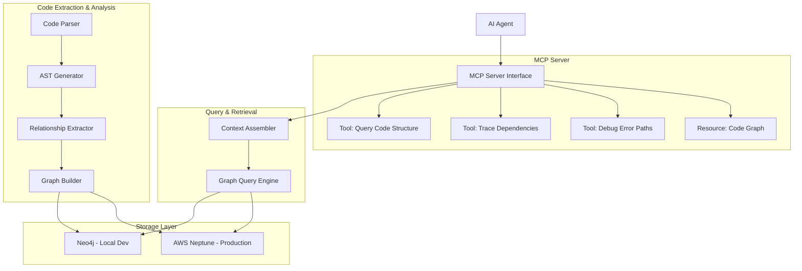

# Graph RAG System for Codebase Understanding

## 1. Introduction

This document outlines potential plan for building a graph-based RAG system for AI agents to understand codebases. 
The system will be implemented as an MCP Server to query and retrieve relevant code context.

## 2. System Architecture Overview



## 3. Graph Schema Design

### 3.1 Node Types

The graph schema includes the following primary node types:

- **Repository**: Represents a code repository (considered a service)
- **Directory**: Represents a directory in the file system
- **File**: Represents a source code file
- **Module**: Represents a code module or library
- **Class**: Represents a class definition
- **Method**: Represents a method within a class
- **Function**: Represents a standalone function
- **Statement**: Represents a code statement
- **Expression**: Represents a code expression (for tracking API calls and events)
- **Variable**: Represents a variable declaration
- **APIEndpoint**: Represents an API endpoint
- **MessageEvent**: Represents a message queue event
- **DatabaseTable**: Represents a database table
- **ErrorDefinition**: Represents an error type or definition

Each node contains:
- Unique identifier
- Type-specific properties
- Git hash for version tracking

### 3.2 Edge Types and Properties

Key relationship types include:

- **CONTAINS**: Hierarchical relationship (Repository → Directory → File → Code Elements)
- **HAS_SOURCE**: Links private modules to their source repository
- **IMPORTS/EXPORTS**: Module dependencies
- **CALLS**: Function/method call relationships
- **PUBLISHES/SUBSCRIBES**: Message event relationships
- **ACCESSES**: Database access patterns
- **THROWS/HANDLED_BY**: Error propagation paths
- **DEPENDS_ON**: Cross-repository dependencies

## 4. Implementation Plan

### 4.1 Core Components

1. **Code Extraction & Analysis**
   - Code Parser: Parse source code files
   - AST Generator: Generate Abstract Syntax Trees
   - Relationship Extractor: Identify code relationships
   - Graph Builder: Construct graph representation

2. **Storage Layer**
   - Neo4j Integration (Local Development)
   - AWS Neptune Integration (Production)

3. **Query & Retrieval**
   - Graph Query Engine: Execute graph queries
   - Context Assembler: Format retrieved data

4. **MCP Server**
   - MCP Server Interface: Handle requests
   - MCP Tools: Expose functionality to AI agents

## 4. MCP Server Implementation

### 4.1 MCP Tool Specifications

The MCP Server will expose the following tools:

1. **Query Code Structure**: Retrieve code structure information
   - Input: File path, function name, class name, depth
   - Output: Nodes and relationships representing code structure

2. **Trace Dependencies**: Follow dependency chains across repositories
   - Input: Source path, direction, dependency types, max depth
   - Output: Dependency paths and summary information

3. **Debug Error Paths**: Identify potential error propagation paths
   - Input: Error message, function name, repository name
   - Output: Potential error paths with probability and recommendations

### 4.2 Example Queries

```cypher
// Find API endpoints and their handlers
MATCH (e:APIEndpoint)-[:EXECUTES]->(f:Function)
RETURN e.path AS endpoint, e.method AS method, f.name AS handler

// Trace message event flow
MATCH (pub:Expression)-[:PUBLISHES]->(e:MessageEvent)<-[:SUBSCRIBES]-(sub:Expression)
WHERE e.name = 'ORDER_CREATED'
RETURN pub, e, sub

// Find database access patterns
MATCH (e:Expression)-[:ACCESSES]->(t:DatabaseTable)
WHERE t.name = 'Orders'
RETURN e, t

// Trace error propagation
MATCH path = (source:Expression)-[:THROWS]->(err:ErrorDefinition)<-[:HANDLED_BY]-(handler:ErrorHandler)
WHERE source.fileId = 'file123'
RETURN path

// Find cross-repository dependencies
MATCH (r1:Repository)-[:DEPENDS_ON]->(r2:Repository)
WHERE r2.name = 'shared-utils'
RETURN r1.name AS dependentRepository, r2.name AS dependedOnRepository
```

## 5. Integration with Neo4j and AWS Neptune

The system will support both Neo4j (for local development) and AWS Neptune (for production) through a common interface. This abstraction will allow for seamless switching between graph database providers.

